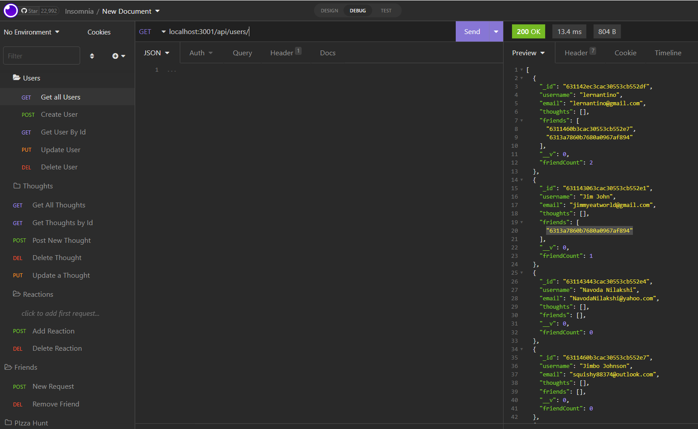

## Purpose
An API for a social network web application where users can share their thoughts, react to friends' thoughts, and create a friend list. Technologies used include Express.js for routing, MongoDB database, and the Mongoose ODM. 

## ScreenShot

## Video Walkthrough demonstration

## Github URL: 
https://github.com/smith-utxo/Mongo_Social_Network_API

## Legal Notice: 
 © Adam T. Smith, U of M Coding Boot Camp 
Licensed under the [MIT license](LICENSE)

## Contributors
- Adam T. Smith <smith.adam937@gmail.com> 